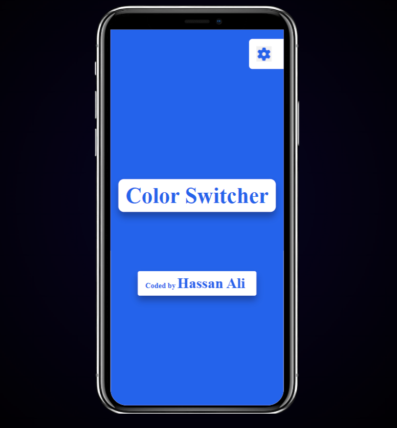
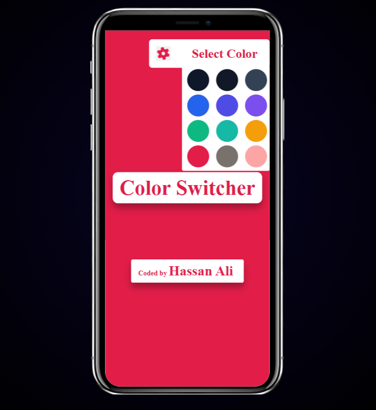
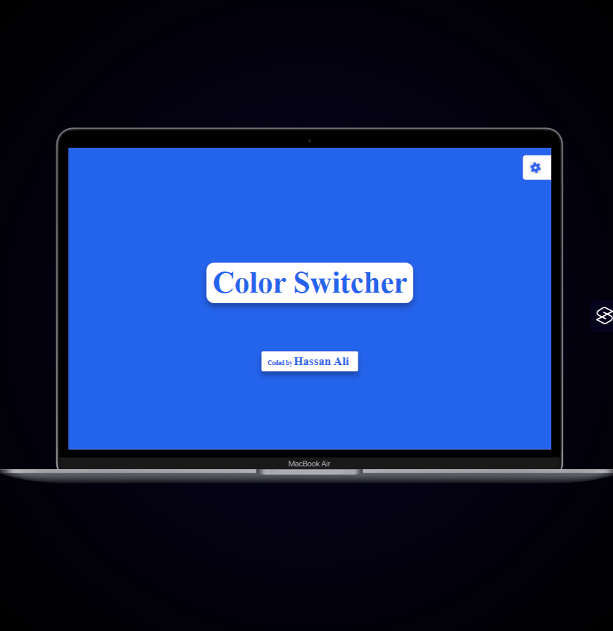

# 🎨 Color Switcher

## Project Overview

**Color Switcher** is a lightweight, interactive web application that allows users to dynamically change the **background and text colors** of the page using a palette of 12 professional themes.

This project was built to practice:

- **DOM manipulation**
- **Event handling**
- **Accessibility best practices**
- **Dynamic styling without repetitive code**

---

## 🌟 Key Features

- Switch between **12 professional color themes** dynamically
- Theme applies to both **background and text** simultaneously
- **Smooth palette toggle animation** using CSS `transform`
- Fully **keyboard-accessible buttons** with visible focus
- **Accessible**: ARIA labels and attributes used for screen readers

---

## 🛠 Tech Stack

- **HTML5** – Semantic structure, accessible elements
- **CSS3** – Variables, grid layout, responsive styling, transitions
- **JavaScript (ES6+)** – DOM traversal, `forEach`, event delegation, `dataset` attributes

---

## ⚙ Architecture & Approach

- **Data-driven theming**: Buttons carry `data-bg` and `data-text` attributes, allowing **dynamic theme application** without repeating CSS classes
- **Event delegation**: Single `forEach` loop handles click events for all buttons
- **Scalable**: Adding a new color requires **only HTML changes**
- **Separation of concerns**: HTML for structure, CSS for style, JS for behavior

---

## ♿ Accessibility

- Buttons are **focusable via keyboard** (`tabindex` handled automatically)
- ARIA attributes:
  - `aria-expanded` on palette toggle
  - `aria-controls` linking palette to toggle
  - `aria-label` describing button action
- Visible focus outlines are preserved for **keyboard navigation**

---

## 📚 Learning Outcomes

### Core JavaScript & DOM Skills

- Practiced **DOM element selection** using `querySelector` and `querySelectorAll`
- Used **`addEventListener`** to handle user interactions
- Worked with the **event object** to access the clicked element
- Iterated over NodeLists using **`forEach`**

### Class-Based Styling (Initial Approach)

- Implemented theme switching using **predefined CSS classes** on the `body`
- Used `classList.add`, `classList.remove`, and `classList.toggle`
- Learned how to **remove multiple classes efficiently** using the **spread operator**
- Understood the limitations of class-based approaches as the number of themes increased

### Refactoring & Scalable Architecture

- Identified **code repetition** and scalability issues in the initial solution
- Refactored to a **data-driven approach** using `data-bg` and `data-text` attributes
- Eliminated the need for predefined theme classes on the `body`
- Dynamically applied styles using JavaScript instead of hard-coded CSS classes
- Designed the solution so **adding a new color requires no JS or CSS changes**

### CSS & Layout Learnings

- Used **CSS variables** for consistent and maintainable color management
- Learned the difference between `relative`, `absolute`, and `fixed` positioning
- Used **`transform: translate()`** for smoother animations and precise positioning
- Improved responsiveness and avoided layout shifts on smaller screens

### Accessibility Awareness

- Used semantic **`button` elements** for better keyboard support
- Implemented **ARIA attributes** such as `aria-label`, `aria-expanded`, and `aria-controls`
- Ensured visible focus states for keyboard users
- Learned to think about accessibility **early**, not as an afterthought

### Engineering Mindset

- Learned to **iterate and refactor** solutions instead of stopping at a working implementation
- Developed an understanding of why **data-driven UI patterns** scale better than class-heavy approaches
- Practiced separating **structure (HTML), style (CSS), and behavior (JS)** in a small project
- Gained experience reviewing and improving existing code based on maintainability concerns

## 🚀 Future Improvements

- Persist the selected theme between page reloads
- Extend theme application to more UI elements (e.g., headers, links)
- Allow users to define custom color themes
- Refine animation timing and transitions for smoother palette interactions

## 🖥️ Screenshots

### 📱 Mobile View

### 🎯 Active Theme

### 🖥️ Desktop View

## 🌐 Live Demo

[Click here to view live demo](https://your-demo-link.com)

---

## 👨‍💻 Author

**Hassan Ali** – [GitHub](https://github.com/hassan-ali-byte)

---

## 💬 Feedback

Feedback, suggestions, and code review comments are always welcome.  
If you have ideas for improving scalability, accessibility, or architecture, feel free to share.

---

## 🎨 Design Inspiration

The visual concept for the color palette was inspired by a public CodePen shared by another developer.

The implementation, JavaScript logic, accessibility handling, and architectural decisions were built independently as part of my own learning and refactoring process.
